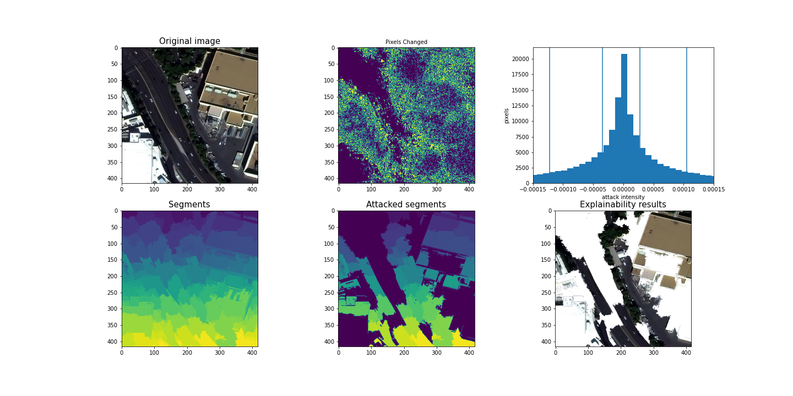

# Explaining-object-detection-models

This repo aims to use adverserial attacks[1] to explain the outcomes of a yolov3 object detection model. The yolov3 model used in this repo is a modified verion of this repo (https://github.com/eriklindernoren/PyTorch-YOLOv3)



### How to run
``` 
# install required packages
conda env create -f exp_obj.yml

# run demo on jupyter notebook
jupyter notebook
```

<a id="1">[1]</a> 
Arash Rahnama, Andrew Tseng (2021).
An Adversarial Approach for Explaining the Predictions of Deep Neural Networks
CVPR Workshops, 2021, pp. 3253-3262.